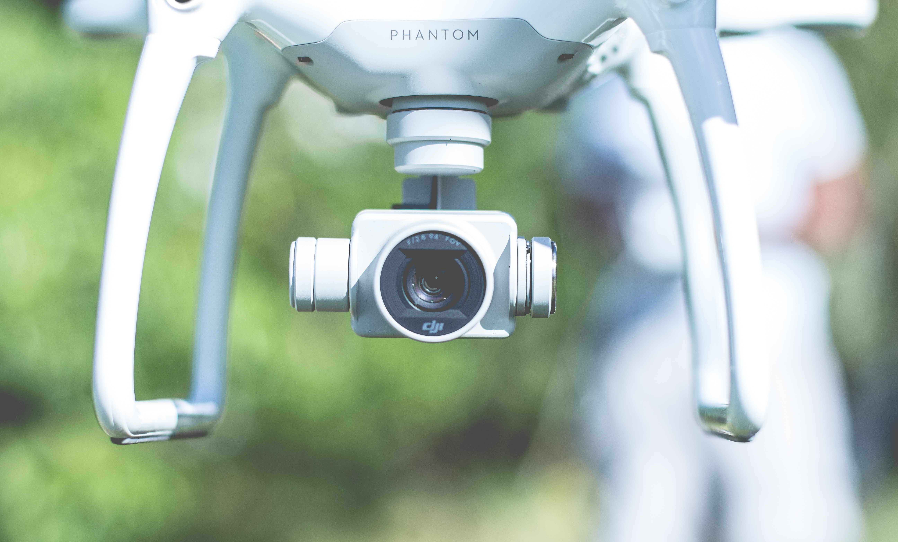

# Artificial Intelligence

---

## Introduction

Artificial Intelligence is the new buzzword that no one can go without. The reasons are simple; AI has given as self-driven cars, fancy robots that have close to human intelligence and many many more. Experts predict that AI will significantly improve the lives of humans in years to come. Even now, we are enjoying some of the benefits of this awesome technology

**Artificial Intelliggence** is the act of giving machines the ability to perform human-level tasks without explicit programming.

**Algorithm**: An Algoritm is an advance mathematical function that find pattern in data.

**Augumented Intelligence**: This refers a situation where people and machines work together to create knowledge from data in that enhances human expertise

**Cognitive Computing**: This refers to systems that learn to perform human-level tasks by interacting and experiencing their environment

**Strong AI**: These are systems that are autonomous enough to think and act on their own. Example include; DeepMind, Human Brain Project and OpenAI.

**Weak AI**: These are systems that cannot think and act on thier own. An example is a chatbot.

## Levels of AI

1. **Artificial Narrow Intelligence(ASI)**: This syetem belong to the Weak AI category. It refer to applying AI to a specific single domain. Chatbots fall into this category.

2. **Artificial General Intelligence(AGI)**: This falls in the Strong AI category. Machines produced from this system can perform almost all tasks on thier own. We are currently heading towards this system.

3. **Artificial Super Intelligence(ASI)**: This also falls within the Strong AI category. Sytems build from this category have full autonomy. They can perform tasks that surpase human intelligence

## AI Systems

1. **Deterministic System**: These system produce a know output with a given input. This means that all outcomes are known and certain.

2. **Probabilistic Sytems**: This systems depend on the confidence values of returned responses. Thier oucomes are not known with certainty.

## AI Influencers

1. **Big Data**: This is a crucial influencer of AI. Big Data has 5 attributes;

   - **Variety**: Big Data comes in different categories. There text, audio, video, etc.

   - **Volume**: Big Data comes in large volumes. This is because people are constantly generating content on platforms like Facebook, Twitter, etc.

   - **Velocity**: The rate at which data is generated is rapid. For instance [reports](https://www.forbes.com/sites/bernardmarr/2018/05/21/how-much-data-do-we-create-every-day-the-mind-blowing-stats-everyone-should-read/#1d4ca38f60ba) indicates that 2.5 quintillion bytes of data is created each day.

   - **Veracity**: This refers to the uncertain and imprecise nature of Big Data.

   - **Visibility**: This talks about how information need to make sense to people. If people can't "see" information, they cannot benefit from it.

## AI Areas

1.  **Machine Learning**

2.  **Natural Language Processing**

3.  **Computer Vision**

4.  **Business Analytics**

5.  **Big Data**

---

#### references

1. [https://developer.ibm.com/africa/skills/artificial-intelligence-v2/](https://developer.ibm.com/africa/skills/artificial-intelligence-v2/)

2. [https://www.amazon.com/Practical-Machine-Learning-Python-Problem-Solvers/dp/1484232062](https://www.amazon.com/Practical-Machine-Learning-Python-Problem-Solvers/dp/1484232062)
