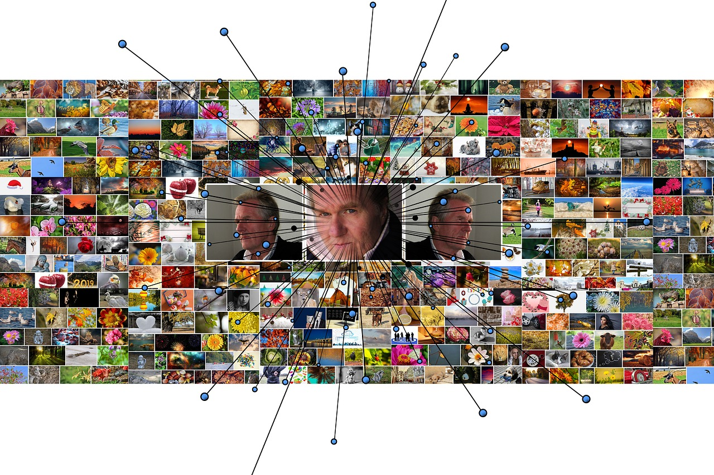

# Machine Learning

---

## Introduction

> Machine Learning is the ability of a computer to learn to perform human-level task without being explicitly programmed. - Arthur Samuel(1959)

**Data Mining** is the act of digging into large datasets in order to discover inherent patterns.

## ML Solves The following problem well;

1. Problems requiring long rules(if-else statements) to solve.

2. Complex problems without traditional solutions.

3. Problems requiring quick and continuous adaptation.

4. Problems requiring getting insights from large datasets.

## Types of ML Systems

Machine Learning sytems are grouped by the following criteria;

1. Supervision or not
   - supervised
   - unsupervised
   - Reinforcement learning
2. Incremental or on the fly

   - online
   - batch learning

3. Comparing new datasets or detecting patterns by building a model

   - instance-based
   - model-based learning

## Supervised Learning

**Supervised learning** involves feeding the algorithm with both the data and the desired outcome(labels).

### Types of Suppervised Learning algorithms

#### Classification

**Classification** results in an outcome that represent the probability that a value belongs to a given class(for example 80% chance of a picture being a cat or a dog).

#### Classification Algorithms

1. K-nearest Neighbors Classification

2. Logistic Regression

3. Support Vector Machines

4. Naive Bayes Clssification

5. Decision Tree Classification

6. Random Forest Classification (Emsemble methods)

#### Regression

**Regression** based models are trained on data inputs that return outcomes with continuous numeric values. Examples include the prediction of house and stock prices.

#### Regression Algorithms

1. K-nearest Neighbors Regression

2. Linear Regression (simple and Multiple Linear Regression)

3. Polynomial Regression

4. Support Vector Regression

5. Naive Bayes Regression

6. Decision Tree Regression

7. Random Forest Regression (Emsemble methods)

## Unsupervised Learning

**Unsupervised Learning** involves finding inherent insight in data without labels rather than predicting values from a know outcome. In short, unsuppervised learning does not involve labels.

### Unsupervised Learning Algorithms

1.  Clustering

    - k-Means
    - Hierarchical Cluster Analysis (HCA)
    - Expectation Maximization

2.  Dimentionality reduction

    - Principal Component Analysis (PCA)
    - Kernel PCA
    - Locally-Linear Embedding (LLE)
    - t-distributed Stochastic Neighbor Embedding (t-SNE)

3.  Anomaly detection

4.  Association rule-mining

    - Apriori
    - Eclat

## Challanges of ML

1. Insufficient quantity of training data

2. Non-representative training data

3. Sample noise(if sample is too small) and sample bias(if sample is too large)
4. Overfitting( the model generalize well on training data but perform poorly on unseen data)

5. Irrelevant features

6. Poor quality data

7. Feature Engineering (difficulty in feature engineering)

---

##### references

[https://www.amazon.com/Practical-Machine-Learning-Python-Problem-Solvers/dp/1484232062](https://www.amazon.com/Practical-Machine-Learning-Python-Problem-Solvers/dp/1484232062)

2. [https://machinelearningmastery.com/introduction-to-tensors-for-machine-learning/](https://machinelearningmastery.com/introduction-to-tensors-for-machine-learning/)

3. [https://en.wikipedia.org/wiki/Marginal_distribution](https://en.wikipedia.org/wiki/Marginal_distribution)

4. [https://www.amazon.com/Hands-Machine-Learning-Scikit-Learn-TensorFlow-ebook/dp/B06XNKV5TS](https://www.amazon.com/Hands-Machine-Learning-Scikit-Learn-TensorFlow-ebook/dp/B06XNKV5TS)
