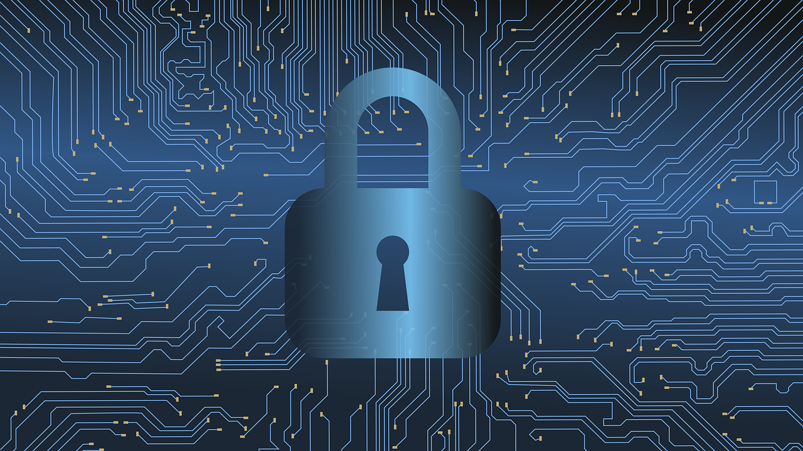

# Cybersecurity

---

## Introduction

> CyberSecurity is the practice of protecting and preserving the CIA Triad (Confidentiality, Integrity and Availaility) of a computing sysems from attackers.

## Objectives of Attacks

Attacks are carried out in order to achive the followwing objectives;

- Accessing sensitive informations
- Changing sensitive information
- Destroying Sensitive information
- Extort money from victims
- Interrupting business processes

## Layers in Cybersecurity

There are four layers in Cybersecurity;

1. **People**: People are the weakest link in the Cybersecurity chain. Thhis is ecasues they are most susceptible to attacks. They are usually the first point of contact an attacker has with a system. They make the weak passwords, give away sensitive information or directly attack other parts of a system.

2. **Processes**: Business processes and supply chain processes can also be a point of attack on a system. Any vulnerability in the process can be exploited by an attacker.

3. **Technology**: The type of technology a company is using can also be a source of vulnerability that an attacker can exploit. Irregular update, using patched or pirated software can introduce vulnerabilities into a system and can be easily exploited by an attacker.

## Scope of Cybersecurity:

**Cybersecurity** comprises of the security of some many crucial parts of a system. The world is interconnected so much that an attack in one part of a system can spread to other areas. That is why Cybersecurity has a wild scope;

1. **Critical Infrastructure Security**: Most systems are crucial to the very survival of most organizations and people as well. This therefore, means that a breach in a sytem like the water sytems, Nuclear Plants, etc can have adverse effects on lives. It is crucial that these infrastructures are protected securely.

2. **Network Security**: Networks are a crucial part of any organization in the internet age. As a result, it is also prone to attacks. Malwares, Denial of Service(DoS) attacks, among others are some of the attacks on a network.

3. **Cloud Security**: As Clouding computing continues to grow and the benefits and uses continues to rise, there is the need for security for the components of the cloud. Most organizations run their infrastructure(IaaS), Software(SaaS), Platform(PaaS), etc on the cloud. That is why the cloud has become a crucial point of interest to organizations and attackers alike. One seeks to secure it but another seeks to infiltrate it.

4. **Application/System Security**: Most organizations use a form of application to carry out thier business. These systems are vulnerable to attacks whch cripple the activities of the business. Malwares like worms, man-in-the-middle attacks are some examples of these vulnerabilities.

5. **User Security**: The user represent the weakest chain in a system in terms of security. Social Engineering attacks are some of the vulnerability from the user in a system. It is therefore, mportant that user security is made a priority in every system.

6. **Internet of Things(IoT)**: As more and more devices are connected to the internet, the rate of cyber attack has also increased. It is important that these decvice are safeguarded from attacks. Braeches in devices like smart doors, home appliances, cars can lead to lose of lives.

## Terminology

**Cybercrime**: refers to any crime commited with a computer as the main or an accessory object of the crime.
**Ransomware**: is a form of an attack on a system with the aim of extorting money or something of value from the victim.
**Malware**: is a malicious software use by attackers to gain unauthorised access or damage to a system. There are 3 types;

- **Worms**: is a malware that affects other systems thus corrupting files and softwares.
- **Trojans**: is a malware that disquises itself as a harmless item with the intention of stealing sensitive information from a system. It is derived from the Wooden Horse used to decieve the trojans from Ancient Troy.
- **Viruses**: is a malware that duplicate itself in a system and causes damage to resources in the system.

**Social engineering**: is a form of attacker use by attackers to manipulate people into given away sensitive information that they can use for attacks.

**Phishing**: is an attack that involves sending fraudulent emails, that claim to be from reputable sources, to users.

**Botnet**: A network of zombie devices that have been infected with
malware to make them perform certain tasks, such as denial of service
attacks. An example is Mirai.

**Data breach**: refers to a situation where a corporate network is attacked by cyber criminals and
some valuable data is stolen. This attacks include stealing customer authentication
details, addresses, and their financial information.

**DDoS attack**: Attackers target a machine by overwhelming the machine with a number of requests thus denying legitimate users access to the system.
