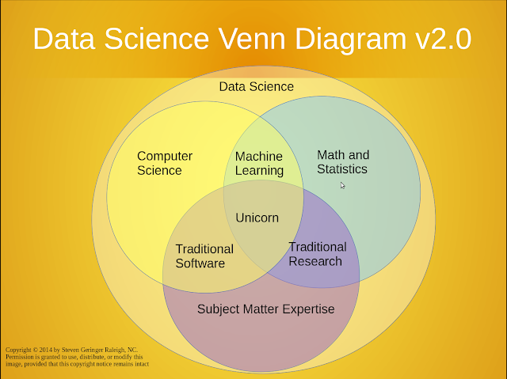
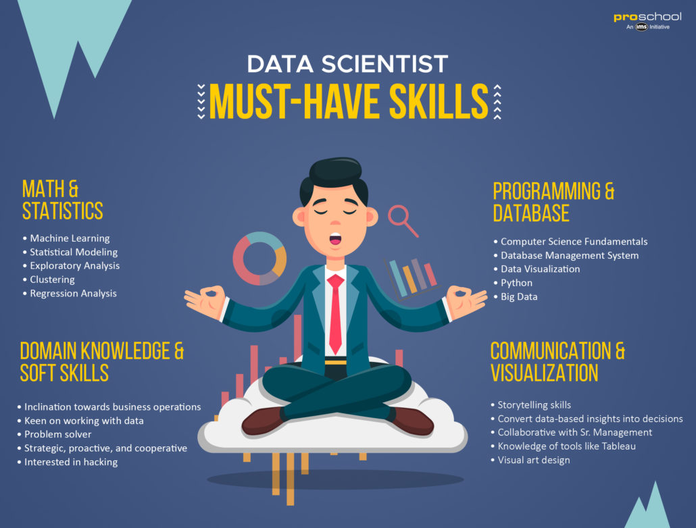

# Data Science

---

## Introduction

---

**Data Science** is among the new technologies that make the ["Industrial Revolution 4.0"](https://en.wikipedia.org/wiki/Industry_4.0). It has become a crucial part of every company and every successful economy. Billion of dollars are up for grab in the data economy. In fact Data Science is called the ["sexiest job of the 21st Century"](https://www.forbes.com/sites/sap/2014/01/21/data-scientist-sexiest-job-of-the-century/#1ebdf15a674b). The reasons for the data hype are numerous; they include;

1. **[Data Deluge](http://science.psu.edu/sciencejournaldec2012/archives/june-2016/features/data-deluge)**: Huge volumes of data in all forms (text, videos, images, etc) are generated daily. All these data need to be analyzed to gain valuable insight for decision-making.

2. **[Moore's law](https://en.wikipedia.org/wiki/Moore%27s_law)**: The computing power required to process these huge data volumes are now possible due to advancement in computing devices and storage. For example GPU and TPU have significantly reduced the time needed to run some algorithm that usually take way longer before these technologies were created.

## What is Data Science?

**Data Science involves the activity of analyzing large and usually messy datasets in order to extract knowledge and insight for decision-making.**

Data Science is an interdisciplinary field of study that includes maths, computer science, etc.



[source](https://www.kdnuggets.com/2016/10/battle-data-science-venn-diagrams.html)

## Skills that make a Great Data Scientist

The following are the required skills tha makes a great data scientist;

### Soft Skills

1. **Curiosity**: Data Science involves uncovering knowledge and insight buried deep in messy. This means that to excel as a Data Scientist, you must learn to embrace your curiosity and explore options.

2. **Problem-Soving**: Data Scientist are problem-solvers. They use insights from data to solve real world problems.

3. **Communication Skills**: The ability to communicate insight in a clear way for non-technical people to understand is crucial to the success of any Data Scientist.

4. **People Skills**: Data Scientist rarely work alone. As such, the ability work well with other people is important for any data scientist to master if they will get far.

5. **Critical Thinking**: The ability to analyze siuations/solutions/problems and select the most viable from alternatives as well as continually eveluate the solution so as to make incremental changes is required for anyone who want to be a Data Scientist

### Technical Skills

---

1. **Coding (Python/R/etc.)**: Coding is an essential part of the skillset of Data Scientist. Python and R are the most popular languages used in Data Science. Python has many tools that makes the work of a Data Scientist easy. Examples include Numpy, Pandas, Matplotlib, etc.

2. **SQL**: Databases are the primary storage of most of our data. It therefore crucial that you learn to write sql queries to retrieve data from datanbases.

3. **Big Data**: Large volumes of data requires large processing capacity. That is why technologies like Hadoop, Apache Spark were created to handle these huge data with its attributes.

4. **Machine Learning**: Machine Learning is a crucial part of Data Science. Machine Learn is the ability to make computers learn from data. Deep learning a subset of machine learning is responsible for all the cool we see today like self-driving cars and chatbots.

5. **Data Visualization**: Data communication through visualization is also important in the toolset of a Data Scientist. After all, if you can't communicate your results to non-technical people, how will would your work benefit them?

6. **Domain Knowledge**: Knowledge and intuition about the field in which you are working is also important in the accurate analysis of Data Science results and subsequent business applications.



**sources**

1. [https://www.proschoolonline.com/blog/data-science-skills](https://www.proschoolonline.com/blog/data-science-skills)

2. [https://www.kdnuggets.com/2018/05/simplilearn-9-must-have-skills-data-scientist.html](https://www.kdnuggets.com/2018/05/simplilearn-9-must-have-skills-data-scientist.html)

3. [https://www.cio.com/article/3263790/data-science/the-essential-skills-and-traits-of-an-expert-data-scientist.html](https://www.cio.com/article/3263790/data-science/the-essential-skills-and-traits-of-an-expert-data-scientist.html)

### Data Science Part Definitions

#### Mathematics

**Scaler**: A scaler is a single number. examples include the numbers 1 or 2, or 3 as single units and not a part of a list.

**Vector**: Vectors are arrays of numbers aranged in some order.

```python
   data = [1,2,3,4,5] # the variable data is a one dimensional vector
```

**Matrix**: A matrix is a two-dimensional array (often called a 2D array). Elements of a matrix are stored in row and collumns.

```python
   myMatrix = [
    [1, 2, 3, 4, 5],
    [2, 1, 4, 5, 2],
    [5, 2, 0, 4, 8]] # a 3 X 5 matrix
```

**Tensor**: Tensors are multidimensional and multi-generic arrays.

```python
   # a tensor
    from numpy import array
    T = array([
    [[1,2,3],    [4,5,6],    [7,8,9]],
    [[11,12,13], [14,15,16], [17,18,19]],
    [[21,22,23], [24,25,26], [27,28,29]],
    ])
```

**Random Variable**: A variable who's outcome depends on chance. This variable can be discrete or continuous.

**Probability Distribution**: This refers to an arrangement that depicts the possibility of a random variable assuming a probable state.

**Probability Mass Function**: refers to a distribution over discrete random variables. It includes Binomial and Poisson Distributions.

**Probability Density Function**: This refers to distribution over continuous random variables. Examples include Normal, Uniform and Student's T Distributions

**Marginal Probability**: The marginal probability of a sample made up of random variables is the probabilty distributions of elements in the sample.

**Conditional Probability**: This refers to the probability that an event will take place given that another event took place.For example, the probability that you will a car is depend on the fact have money.

#### Statistics

Statistics is a branch of mathematics that deals with the colletion, organization, analysis, interpretation and presentation of data. There are two types;

1. **Descriptive Statistics**: This refers to the descriptive coefficients that summarizes a given dataset for better understanding. It includes finding central tendenciesike mean, median, mode, and other coefficients that describe a dataset.

2. **Inferential Statistics**: This involves testing a hypothesis and drawing a conclusion from features of a population.

#### Data Mining

Data Mining involves processes, methodologies, tools and techniques to discover and extract patterns, knowledge and valuable insights from messy datasets.

#### Artificial Intelligence(AI)

Artificial Intelligence is the art, science and engineering of making ntelligent agents and machines that perform human specific tasks. It includes fields such Machine Learning, Natural Language Processing, etc.

#### Natural Language Processing(NLP)

Natural Language Processing is a multidisciplinary field of AI that combines conputational linguistics, machine learning and computer science to help computers process, understand and interpret natural human language. Application of NLP includes;

- Machine translation
- Speech recognition
- Question answering systems
- Context recognition and resolution
- Text summarization
- Text categorization
- Information extraction
- Sentiment and emotion analysis
- Topic segmentation

#### Deep Learning

Deep Learning is a sub-field of Machine Learning that mimick the biological brain to help machines extract insights from messy data.

##### references

1. [https://www.amazon.com/Practical-Machine-Learning-Python-Problem-Solvers/dp/1484232062](https://www.amazon.com/Practical-Machine-Learning-Python-Problem-Solvers/dp/1484232062)

2. [https://machinelearningmastery.com/introduction-to-tensors-for-machine-learning/](https://machinelearningmastery.com/introduction-to-tensors-for-machine-learning/)

3. [https://en.wikipedia.org/wiki/Marginal_distribution](https://en.wikipedia.org/wiki/Marginal_distribution)
