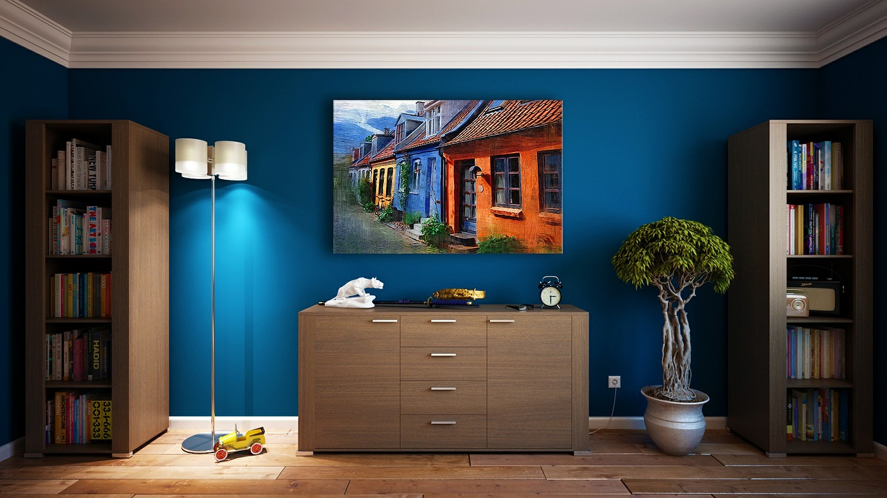

# Design

---

## Introduction

> Design is Design, is Design, is Design. Everything is Design. - Joe Natoli

**Design** is all around us. Everything you see around you is evidence of design and so follows the principles. You are wonderfully design by the Creator. Being created in the image of God means you possess to a certain degree, the qualities of God including the ability to Design. Learning the principles of design enable you to nurture and develop your inner Design.

## Principles of Design

1. **Design is Design(not decoration)**: Design is not just how it looks, _it is also how it works (- Steve Jobs)_. Throwing paint on a screen is not design, it's just throwing paint on the screen :). Design is the functioning of a system and how pleasant it is to use the system.

2. **Design is the Act of Listening**: The best designed systems are the ones that satisfies the needs of the end user. Emapthy and good listening skills are crucial to the designer who want to be a pro.

3. **Design is Storytelling**: Design is the user's experience in the system. It is how its feels to interact with the system.

4. **Design is Function, then Form**: Design is first, how it works, then how it looks.

5. **Design is Simple**: Simple in Design is better than complex and complicated. _Simplicity is the Ultimate perfection(Leonardo DaVinci)_. Design is being precise and concise. If you can't make it simple then you don't know Design.

6.**Design is Problem-Solving**: Design is solving real-world problem and making live easier for your users.

7. **Design is Inclusive(Accessibility)**: Design is including the needs of all your users when designing the system.

8. **Design is Consistency**: All elements in a system should be consistent. Fonts, aligmnents, colors, typography, etc should be consist in a digital product.

9. **Design is Research**: Design is getting firsthand knowledge about your users, tools, methodology, etc. It also involves a lot of testing and experimentation.

10. **Design is Communication**: Design is sending the right message in the right way to solicit the right response.

---

##### references

1. [https://www.figma.com/resources/learn-design/](https://www.figma.com/resources/learn-design/)
2. [https://www.udemy.com/design-rules/](https://www.udemy.com/design-rules/)
